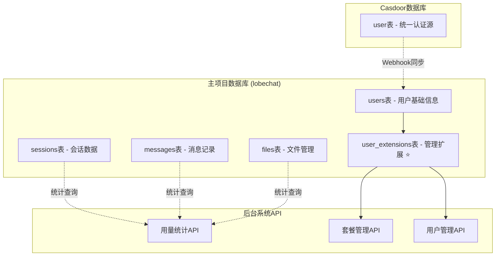

# 🎯 ProtoChat 简化架构设计

## 📋 架构概览

基于你的建议，我们采用了**简化单一数据库架构**：



## ✅ 简化优势

### 1. **最小化改动**
- ✅ 只新增1个表：`user_extensions`
- ✅ 删除了4个冗余表：`usage_statistics`、`realtime_usage`、`user_limit_logs`、`user_subscription_history`
- ✅ 复用现有业务数据

### 2. **数据来源真实**
- ✅ 用量统计直接查询 `messages`、`sessions`、`files` 表
- ✅ 避免数据同步和一致性问题
- ✅ 统计结果基于真实业务数据

### 3. **架构简洁**
- ✅ 单一数据库：只使用 `lobechat` 数据库
- ✅ 不连接 `Casdoor` 数据库
- ✅ 减少运维复杂度

---

## 📊 核心表结构

### `user_extensions` 表
**唯一的后台管理扩展表**

| 字段名 | 类型 | 说明 |
|--------|------|------|
| id | serial | 主键 |
| user_id | text | 关联主项目users.id |
| current_plan | text | 当前套餐 (free/basic/pro/enterprise) |
| plan_expires_at | timestamptz | 套餐过期时间 |
| monthly_token_limit | integer | 月度Token限制 |
| monthly_api_calls_limit | integer | 月度API调用限制 |
| monthly_storage_limit | integer | 月度存储限制(MB) |
| features | jsonb | 功能配置 |
| is_suspended | boolean | 是否暂停 |
| admin_notes | text | 管理员备注 |

---

## 🚀 API端点

### 用户管理
```bash
# 获取用户列表 + 用量统计
GET /api/users?page=1&limit=20&search=keyword

# 获取用户详细用量
GET /api/users/:userId/usage
```

### 套餐管理
```bash
# 更新用户套餐
POST /api/users/:userId/plan
{
  "currentPlan": "pro",
  "monthlyTokenLimit": 100000,
  "monthlyApiCallsLimit": 1000,
  "monthlyStorageLimit": 10240,
  "features": {
    "basicChat": true,
    "fileUpload": true,
    "advancedModel": true
  }
}
```

### 用量管理
```bash
# 重置月度使用量
POST /api/users/:userId/reset-usage
```

---

## 🔧 用量统计实现

### 直接查询业务表
```sql
-- 消息统计
SELECT COUNT(*) as message_count
FROM messages
WHERE user_id = $1 AND created_at >= date_trunc('month', current_date)

-- 会话统计
SELECT COUNT(*) as session_count
FROM sessions
WHERE user_id = $1 AND created_at >= date_trunc('month', current_date)

-- 文件统计
SELECT COUNT(*) as file_count, COALESCE(SUM(size), 0) as total_size
FROM files
WHERE user_id = $1 AND created_at >= date_trunc('month', current_date)
```

### 实时查询，无需额外表
- ✅ 统计数据始终是最新的
- ✅ 无需同步和维护
- ✅ 查询性能优秀（有索引支持）

---

## 📁 文件结构

```
admin-system/server/
├── src/
│   ├── db/
│   │   └── user-extensions-schema.ts    # 简化的schema定义
│   ├── services/
│   │   └── usage-service.ts             # 基于现有表的统计服务
│   ├── routes/
│   │   └── users-simplified.ts          # 简化的API路由
│   └── scripts/
│       └── init-simple-user-management.ts # 简化的初始化脚本
└── .env                                 # 连接lobechat数据库
```

---

## 🎯 对比之前

### 之前（复杂架构）
- ❌ 2个数据库连接
- ❌ 5个新增表
- ❌ 复杂的数据同步逻辑
- ❌ 数据一致性问题

### 现在（简化架构）
- ✅ 1个数据库连接
- ✅ 1个新增表
- ✅ 直接查询现有数据
- ✅ 数据天然一致

---

## 🚀 快速开始

### 1. 初始化
```bash
cd admin-system/server
npx tsx src/scripts/init-simple-user-management.ts
```

### 2. 启动服务
```bash
npm run dev  # 端口8003
```

### 3. 测试API
```bash
curl http://localhost:8003/health
```

---

## 💡 核心优势总结

1. **架构简单**：只增加一个扩展表
2. **数据准确**：直接统计真实业务数据
3. **维护简单**：单一数据库，无同步问题
4. **性能优秀**：直接查询，有索引优化
5. **扩展性强**：可随时添加新的统计维度

这个简化架构完全满足你的需求，同时大大降低了复杂度和维护成本！🎉