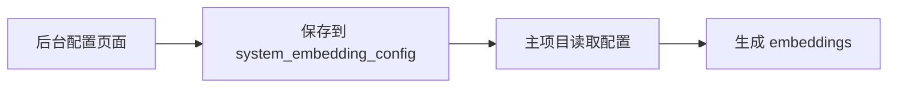
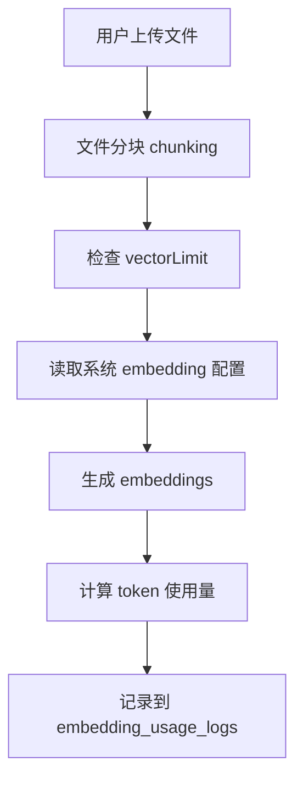

# Embedding Phase 2 实施文档

## 概述

Phase 2 实现了后台 embedding 配置与主项目的集成，以及使用日志记录功能。

**核心功能**：
1. ✅ 主项目从数据库读取系统 embedding 配置
2. ✅ 使用后台配置的供应商和模型
3. ✅ 记录每个用户的 token 使用和成本（美元）
4. ✅ 保留现有的按条数（vectorLimit）订阅限制
5. ✅ 不扣除用户积分

## 实施的文件

### 1. 数据库 Models

#### `packages/database/src/models/systemEmbedding.ts` (新建)
用于读取系统 embedding 配置。

**主要方法**：
- `getConfig()` - 获取系统 embedding 配置
- `isConfigured()` - 检查是否已配置

#### `packages/database/src/models/embeddingUsageLog.ts` (新建)
用于记录 embedding 使用日志。

**主要方法**：
- `create(params)` - 创建单条使用记录
- `batchCreate(logs)` - 批量创建使用记录

### 2. 主项目集成

#### `src/server/routers/async/file.ts` (修改)

**关键修改**：

1. **读取并解密配置** (line 67-110)：
   ```typescript
   const systemConfig = await ctx.systemEmbeddingModel.getConfig();

   let embeddingPayload = ctx.jwtPayload; // Default to user's payload

   if (systemConfig && systemConfig.providerId && systemConfig.modelId) {
     provider = systemConfig.providerId;
     model = systemConfig.modelId;
     modelInputPrice = systemConfig.inputPrice ? parseFloat(systemConfig.inputPrice) : null;

     // Decrypt API Key from system config
     let decryptedApiKey: string | undefined;
     if (systemConfig.apiKey) {
       const gateKeeper = await KeyVaultsGateKeeper.initWithEnvKey();
       const result = await gateKeeper.decrypt(systemConfig.apiKey);
       if (result.wasAuthentic) {
         decryptedApiKey = result.plaintext;
       }
     }

     // Create custom payload with system config
     embeddingPayload = {
       ...ctx.jwtPayload,
       apiKey: decryptedApiKey,
       baseURL: systemConfig.baseUrl || undefined,
     };
   } else {
     // Fallback to environment variable
     const envConfig = getServerDefaultFilesConfig().embeddingModel;
     provider = envConfig.provider;
     model = envConfig.model;
   }
   ```

2. **记录使用日志** (line 156-184)：
   ```typescript
   // Calculate tokens (approximately: characters / 4)
   const batchTokens = chunks.reduce((sum, c) => sum + Math.ceil(c.text.length / 4), 0);
   totalInputTokens += batchTokens;

   // Calculate cost in USD
   const costInUSD = (totalInputTokens / 1_000_000) * modelInputPrice;

   await ctx.embeddingUsageLogModel.create({
     userId: ctx.userId,
     modelId: model,
     providerId: provider,
     inputTokens: totalInputTokens,
     totalTokens: totalTokens,
     costPrice: costInUSD.toFixed(6),
     operationType: 'file_embedding',
     fileId: input.fileId,
     chunkCount: chunks.length,
   });
   ```

## 工作流程

### 配置流程



### 使用记录流程



## 配置优先级

1. **数据库配置** (`system_embedding_config` 表)
   - 如果存在，优先使用
   - 包含：provider, model, inputPrice, baseUrl, apiKey

2. **环境变量配置** (`FILES_CONFIG`)
   - 作为后备方案
   - 格式：`embedding_model=provider/model`

## Token 计算

**估算方法**：`字符数 / 4 ≈ token 数`

这是一个近似值，实际 token 数量由模型的 tokenizer 决定。

**示例**：
- 1000 字符 ≈ 250 tokens
- 一个 chunk (平均 500 tokens) ≈ 2000 字符

## 成本计算

**公式**：
```
成本 (USD) = (totalTokens / 1,000,000) × modelInputPrice
```

**示例**（使用 qwen/qwen3-embedding-4b）：
- 模型价格：$0.02 per 1M tokens
- 生成 100 chunks，每个 500 tokens = 50,000 tokens
- 成本：(50,000 / 1,000,000) × 0.02 = $0.001

## 订阅限制

**保留的限制**：
- `subscriptionPlans.vectorLimit` - 按条数限制
- 检查点：`UserUsageService.checkVectorStorageLimit()`
- 计数方式：`COUNT(*) FROM embeddings WHERE userId = ?`

**不限制**：
- ❌ 不扣除积分
- ❌ 不检查积分余额
- ❌ 不限制 token 使用量

## 数据库表结构

### `embedding_usage_logs`

| 字段 | 类型 | 说明 |
|------|------|------|
| id | serial | 主键 |
| user_id | varchar(64) | 用户ID |
| model_id | varchar(200) | 模型ID |
| provider_id | varchar(64) | 供应商ID |
| input_tokens | integer | 输入 token 数 |
| total_tokens | integer | 总 token 数 |
| cost_price | numeric(15,4) | 成本（美元）|
| user_price | numeric(15,4) | 用户价格（NULL - 不收费）|
| operation_type | varchar(50) | 操作类型 |
| file_id | uuid | 文件ID |
| chunk_count | integer | chunk 数量 |
| created_at | timestamp | 创建时间 |

**索引**：
- `idx_embedding_usage_user` - ON (user_id)
- `idx_embedding_usage_created` - ON (created_at)

## 日志输出

**成功记录**：
```
[Embedding] Using system config: openrouter/qwen/qwen3-embedding-4b
[Embedding] Logged usage: 50 chunks, 25000 tokens, cost: $0.000500
```

**无系统配置**：
```
[Embedding] No system config found, using env config: openai/text-embedding-3-small
```

**记录失败**：
```
[Embedding] Failed to log usage: <error>
```

注意：日志记录失败不会导致 embedding 任务失败。

## 测试

### 1. 配置测试

```bash
# 在后台配置页面
1. 选择供应商：openrouter
2. 同步模型列表
3. 选择模型：qwen/qwen3-embedding-4b
4. 填写 API Key
5. 测试连接
6. 保存配置
```

### 2. 功能测试

```bash
# 在主项目
1. 上传一个文件
2. 等待 chunking 和 embedding 完成
3. 检查日志：应该显示使用了系统配置
4. 查询数据库：
   SELECT * FROM embedding_usage_logs ORDER BY created_at DESC LIMIT 10;
```

### 3. 验证数据

**检查配置**：
```sql
SELECT * FROM system_embedding_config WHERE id = 'default';
```

**检查使用记录**：
```sql
SELECT
  user_id,
  model_id,
  provider_id,
  chunk_count,
  input_tokens,
  cost_price,
  created_at
FROM embedding_usage_logs
ORDER BY created_at DESC
LIMIT 20;
```

**统计用户成本**：
```sql
SELECT
  user_id,
  COUNT(*) as total_operations,
  SUM(chunk_count) as total_chunks,
  SUM(input_tokens) as total_tokens,
  SUM(CAST(cost_price AS NUMERIC)) as total_cost_usd
FROM embedding_usage_logs
GROUP BY user_id
ORDER BY total_cost_usd DESC;
```

## 后续 Phase 3（未实施）

Phase 3 可以添加：
1. 后台统计页面
2. 用户维度的成本分析
3. 时间维度的趋势图
4. 模型使用分布
5. 成本预警机制

## 故障排除

### 问题1：无法读取系统配置

**检查**：
- 数据库表是否创建：`\dt system_embedding_config`
- 配置是否存在：`SELECT * FROM system_embedding_config`

**解决**：手动执行 migration SQL

### 问题2：使用日志未记录

**检查**：
- 日志表是否创建：`\dt embedding_usage_logs`
- 后端日志输出

**可能原因**：
- Model 导入路径错误
- 数据库连接问题
- 权限问题

### 问题3：仍使用环境变量配置

**检查**：
- 系统配置的 `providerId` 和 `modelId` 是否为空
- 后端日志："No system config found"

**解决**：在后台配置页面重新保存配置

## 相关文档

- [Phase 1 实施计划](./EMBEDDING_IMPLEMENTATION_PLAN.md)
- [OpenRouter 配置指南](./OPENROUTER_EMBEDDING_SETUP.md)
- [快速开始](./EMBEDDING_QUICK_START.md)
